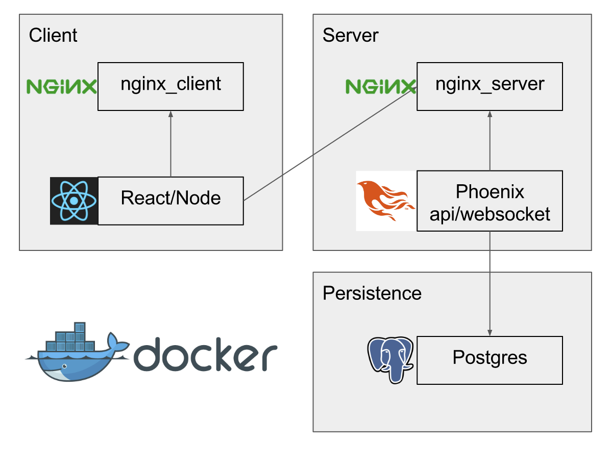

# Instant-Stock

Automated stock trading app with a chat room

### Setup

It is all docker containers, so just run: `docker-compose up`
Web container needs `rake db:create && db:migrate && db:seed` on first
run

Client runs at `/` api server runs on `:4000`

### Goals

Automated stock trading app, with some 'twitch plays pokemon' community
chat behaviour. Mostly an app to play around on and learn

### Architecture

All the services run in docker containers:

Client
 * Node/express JS app, React/Redux/ImmutableJS
 * Nginx load balancer for node app
 
Server
 * Rails/puma Ruby app, Rails5/Websockets
 * Nginx load balancer for rails app
 * Sidekiq broadcasting to websocket
 * Whenever, running cron job (fetches stock prices using a gem API
  request logic was extracted to)
 
Persistence
 * PG db
 * Redis, Sidekiq job data store
 
### TODO

 * Add GraphQL endpoint
 * Add logging service (Graylog?)
 * Setup PG master/slave (PgBouncer?)
 * Upgrade stock quote API to something more reliable
 * Serve react app from s3
 * Paginate main page items
 * Switch to docker swarm
 * Add a Pheonix service (maybe replace rails app)
